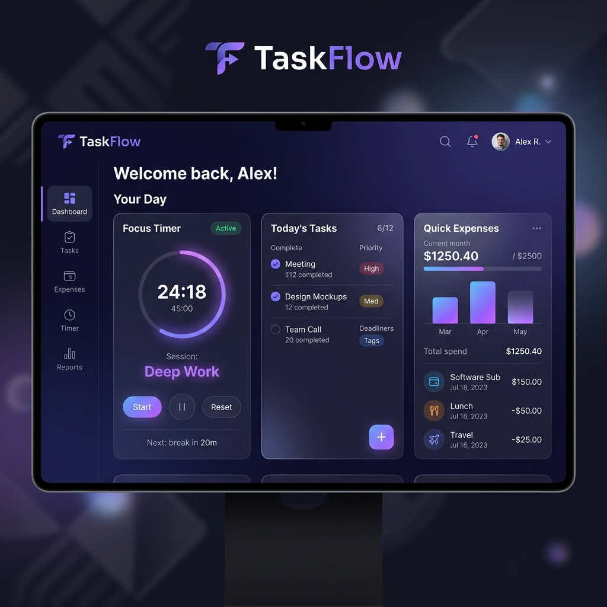

# 🚀 Velitox: High-Performance Productivity Suite

Velitox is a high-performance, professional productivity suite designed to master your daily workflow. Featuring a stunning glassmorphic UI, it combines task management, focus tracking, and financial oversight into one seamless experience.



## ✨ Core Features

- **📊 Intelligent Dashboard**: A centralized hub for real-time activity tracking and productivity metrics.
- **✅ Advanced Task Manager**: Categorize, prioritize, and track tasks with ease.
- **⏲️ Focus Suite (Pomodoro)**: Interactive deep-work sessions with work/break cycles.
- **📝 Premium Notes**: minimalist, color-coded note-taking for your best ideas.
- **💰 Financial Tracker**: Integrated expense management with visual analytics.
- **🌓 Adaptive Theming**: Seamless transition between sophisticated Dark mode and a clean Light theme.
- **🔒 Secure Sync**: Real-time cloud synchronization powered by Firebase.

## 🛠️ Tech Stack

- **Frontend**: React 19 + Vite 8
- **Styling**: Tailwind CSS 3 (Custom Design System)
- **Database/Auth**: Firebase Firestore & Authentication
- **Analytics**: Chart.js
- **Animations**: GreenSock (GSAP) & tsParticles
- **Icons**: Lucide React

## 🚀 Getting Started

### Prerequisites

- Node.js (v18+)
- npm or yarn

### Installation

1. **Clone the repository**
   ```bash
   git clone https://github.com/yourusername/velitox.git
   ```

2. **Install dependencies**
   ```bash
   npm install
   ```

3. **Development Mode**
   ```bash
   npm run dev
   ```

4. **Production Build**
   ```bash
   npm run build
   ```

## 📈 SEO & Performance

Velitox is optimized for search engines and AI agents:
- **Semantic HTML5**: Using proper structural elements for better accessibility.
- **OpenGraph & Twitter Cards**: Professional social media previews.
- **PWA Ready**: Offline persistence and manifest configuration.
- **Performance**: Built with Vite for ultra-fast load times.

## 📄 License

Distributed under the MIT License. See `LICENSE` for more information.

---
*Built with ❤️ by the Velitox Team*
